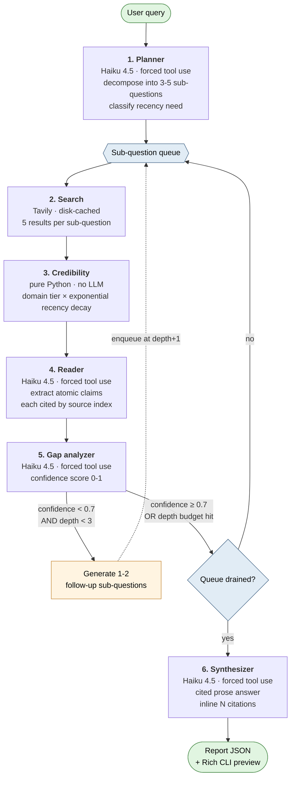

# research-agent

An autonomous web research agent that decomposes a question, retrieves and scores sources, extracts cited claims, iteratively deepens on weak findings, and synthesizes a final report.

Built as a portfolio project to demonstrate applied-AI engineering — the design choices, the eval methodology, and the honest tradeoffs all matter more than any single feature.

> See [`reports/sample-redlock-report.json`](reports/sample-redlock-report.json) for a real end-to-end output — full cited summary, 30 sources, sub-question tree, confidence assessment.

---

## TL;DR — what the evaluation actually shows

I ran the full agent and four comparison variants over a 6-question curated benchmark, scored by an LLM-as-judge across four dimensions (faithfulness, coverage, citation quality, conciseness) plus explicit per-question key-claim hit/miss tracking.

| Variant | Hit rate | Δ vs prior | What's in / out |
|---|---:|---:|---|
| `baseline_no_search` | 91.7% | — | One Claude call, no retrieval |
| `baseline_simple_rag` | 58.3% | −33.4pp | One Tavily search + one synthesis call. No decomposition, no claim extraction, no deepening |
| `ablation_no_deepening` | 75.0% | +16.7pp | Adds the planner + reader stages |
| `ablation_no_credibility` | 95.8% | +20.8pp | Adds the iterative deepening loop |
| **`full_agent`** | **95.8%** | **0.0pp** | Adds credibility weighting |

Three findings worth pulling out:

1. **Iterative deepening accounts for +20.8 percentage points of key-claim coverage.** This is the cleanest isolation of the architecture's headline differentiator — the planner + reader + synthesizer get you to 75% on their own; the deepening loop gets you the rest.

2. **Single-shot RAG underperforms a no-search baseline by 33 points on coverage.** Search alone doesn't beat a strong LLM on topics in its training data. Decomposition + structured extraction are what make retrieval pay off.

3. **Credibility weighting shows no measurable improvement on this benchmark — and removing it actually scores higher.** The `no_credibility` ablation beats `full_agent` on faithfulness (+0.83), citation quality (+1.33), and overall (+0.17), with identical hit rate. See [Known limitations](#known-limitations) — this is a real finding the ablation surfaced, not something I'm hiding.

Full per-dimension table:

| Variant | Overall | Faith | Cover | Cite | Concise | Hits |
|---|---:|---:|---:|---:|---:|---:|
| `ablation_no_credibility` | **7.17** | **7.83** | 8.67 | **7.50** | 5.50 | **95.8%** |
| `full_agent` | 7.00 | 7.00 | 8.67 | 6.17 | 4.83 | 95.8% |
| `ablation_no_deepening` | 6.50 | 7.17 | 7.17 | 7.00 | 6.17 | 75.0% |
| `baseline_simple_rag` | 5.67 | 7.50 | 5.17 | 7.67 | 6.83 | 58.3% |
| `baseline_no_search` | 5.00 | 4.00 | 7.83 | 0.33 | 6.17 | 91.7% |

---

## What it does, mechanically



The loop in stages 2-5 is the iterative-deepening core: a sub-question that scores below 0.7 confidence spawns 1-2 targeted follow-ups, which re-enter the queue at depth+1 and get the same pipeline treatment. The loop exits when the queue drains, the depth budget per branch hits 3, or the global cap of 10 sub-questions is reached.

A few design choices worth noting:

- **Structured pipeline with one decision point**, not a free-form ReAct loop. The stage order is fixed; only the gap analyzer triggers iteration. This makes the system evaluatable (every stage has typed inputs and outputs), debuggable (failures are localized), and bounded (cost and depth are capped by construction).

- **Forced tool use for structured output**. Every LLM stage that produces structured data does it by emitting a forced tool call whose `input_schema` is a Pydantic model's JSON schema. Schema-validated by construction instead of "please return JSON."

- **Citations by index, not by URL**. The reader and synthesizer cite sources by integer index into a provided list. The model cannot invent a citation by remembering a plausible URL — every `[N]` is a pointer into a real retrieved source.

- **Caching everywhere**. Tavily results, agent reports, and judge verdicts all cache to disk. Re-running the eval after tuning the judge rubric costs essentially nothing.

---

## Setup

```bash
python -m venv venv
.\venv\Scripts\activate          # Windows
# source venv/bin/activate       # macOS/Linux

pip install -r requirements.txt
```

Add your API keys to `.env`:

```
ANTHROPIC_API_KEY=sk-ant-...
TAVILY_API_KEY=tvly-...
```

You'll need an Anthropic account with credit (~$5 covers the full project end-to-end including the eval sweep). Tavily has a free tier (1,000 search credits/month) that's plenty for development given the disk cache.

---

## Usage

```bash
python main.py "How does the Raft consensus algorithm elect a leader?"
```

Writes a structured report to `reports/<timestamp>-<slug>.json` and prints a preview to stdout (Rich-formatted).

CLI flags:
- `--max-depth N` — iterative-deepening depth cap per branch (default 3)
- `--out PATH` — output file (default `reports/<timestamp>-<slug>.json`)

Example output (truncated from a real run):

```
## Distributed Locking with Redis

Redis provides a lightweight distributed locking mechanism centered on the SET
command. The Redis SET command is atomic [1], and when combined with the NX
and EX options [2], it forms the foundation of distributed locks. The NX
option ensures the command only succeeds if the key does not already exist
[2], while EX sets an expiration in seconds [2]...
```

---

## Architecture, by file

```
src/
├── agent.py        Orchestrator + every pipeline stage (planner, credibility, reader, gap analyzer, synthesizer, run loop)
├── tools.py        Tavily search with disk cache
├── prompts.py      All system prompts (planner, reader, gap-check, synthesizer)
├── report.py       Pydantic models — typed contracts between every stage
└── config.py       Domain tiers, weights, half-lives, thresholds, budgets

eval/
├── judge.py        LLM-as-judge with the JudgeVerdict schema + rubric
└── run_eval.py     Runner + variant registry + cache + aggregator

data/benchmark/
└── questions.json  10 curated benchmark questions across 4 categories

main.py             CLI entry point
```

---

## Evaluation methodology

```bash
python -m eval.run_eval
```

Runs every registered variant against every verifiable benchmark question, judges each, caches reports + verdicts, prints per-question rows and a per-variant aggregate.

**Benchmark** (10 questions, 4 categories):
- `recent_events` — questions requiring post-cutoff data (3 entries, marked `[VERIFY]` and skipped pending manual reference-answer verification)
- `technical_depth` — algorithm/protocol/mechanism questions with stable answers (3 entries)
- `multi_hop` — questions requiring combining facts from multiple sources (2 entries)
- `ambiguous` — open-ended where calibration matters (2 entries)

Each entry has a `reference_answer`, an atomic `key_claims` list (the eval anchors — these are what the judge checks for), optional `gold_sources`, and a curator note.

**Judge** (Sonnet 4.6, temperature 0.2) scores four dimensions on a calibrated rubric, partitions the benchmark's `key_claims` into hit/missed, and flags `notable_failures` (invented facts, broken citations, off-topic detours). The prompt explicitly addresses LLM-judge benevolence bias ("do not cluster scores around 7"), forbids credit for plausibly-true-but-unsupported claims, and requires the key-claim partition to be explicit.

**Variants** registered in `SYSTEMS`:
- `full_agent` — the complete pipeline (`src.agent.run`)
- `baseline_no_search` — one Claude call with a "use only training knowledge" system prompt; tests pure parametric memory
- `baseline_simple_rag` — one Tavily search + one synthesis call; tests retrieval without decomposition
- `ablation_no_credibility` — full agent with credibility forced to 1.0 on every source
- `ablation_no_deepening` — full agent with `max_depth=0`

Adding a sixth variant is one entry in the `SYSTEMS` dict.

---

## Known limitations

These were surfaced by the eval or noticed during development. Each is documented honestly rather than fixed-away.

**1. Credibility weighting shows no measurable improvement.** As above, `ablation_no_credibility` matches `full_agent` on coverage and beats it on faithfulness and citation quality. The most plausible explanation is that the weighting nudges the synthesizer away from useful low-tier sources (Substack, blogs) even when they have the most query-relevant content. Two paths forward: gate weights on per-claim source agreement rather than per-source absolute tier (i.e., credibility component 3 — cross-corroboration), or remove the layer entirely. Currently deferred.

**2. `recent_events` category is untested.** Three of the ten benchmark entries are marked `[VERIFY]` because their reference answers depend on post-cutoff events I haven't manually verified against live coverage. The agent's strongest theoretical lift — fresh data the no-search baseline structurally can't have — is therefore unmeasured. Verifying these and re-running would likely widen the gap against `baseline_no_search` substantially.

**3. Conciseness scores 5-6 across all variants.** Every system pads, the most-pipelined being the least concise. Confirms this is a synthesizer-prompt issue, not an architectural one. Tightening the prompt is on the future-work list.

**4. `general` planner category is fuzzy.** The query classifier sometimes picks `general` for what's actually `ambiguous` (e.g., a two-word noun fragment like "carbon capture tech"). The downstream impact is small but the category boundary needs sharpening or `general` should be removed.

**5. Curated domain tier list is opinionated and English-biased.** ~35 domains across 4 tiers. Intended as a demo of the design, not as a production-grade trust signal. Scaling means either growing the curated list or learning the signal — both deferred.

---

## Cost

Total Anthropic API spend across all development, integration tests, the full eval sweep (5 variants × 6 questions × judge runs), and CLI testing: **~$5**.

Per full agent run, end-to-end (plan → search → score → read → gap-check → synthesize): **~$0.30**. Pipeline stages 1-5 run on Haiku 4.5; the synthesizer runs on Haiku 4.5 too (Sonnet 4.6 only kicks in during evaluation, when the judge needs to reason).

---

## Future work

In rough priority:

- Verify `[VERIFY]` recent_events entries against live sources; re-run eval to measure the agent's lift on post-cutoff questions
- Replace per-source credibility weighting with per-claim signals: cross-source corroboration count (`len(source_indices) ≥ 2`) and LLM-judged source-claim alignment per citation
- Enable prompt caching on system prompts — Anthropic-side feature that should cut repeated stage costs ~90%
- Tighten synthesizer prompt to address the consistent conciseness gap
- Parallel/async search across sub-questions for latency
- Adapt a subset of SimpleQA or FreshQA as a second, external benchmark

---

## Stack

- **Python 3.14**
- **`anthropic`** — Claude SDK. Haiku 4.5 for pipeline stages, Sonnet 4.6 for the judge.
- **`tavily-python`** — web search; disk-cached locally
- **`pydantic` ≥ 2** — typed contracts at every stage boundary, JSON schemas auto-generated for forced tool use
- **`rich`** — CLI rendering
- **`python-dotenv`** — env loading

---

## Repository layout

```
research-agent/
├── data/benchmark/      curated benchmark questions
├── src/                 pipeline implementation
├── eval/                evaluation harness and judge
├── reports/             generated agent reports (gitignored)
├── eval_runs/           cached eval reports + verdicts (gitignored)
├── .cache/              Tavily search cache (gitignored)
├── main.py              CLI
├── requirements.txt
└── .env                 API keys (gitignored)
```
